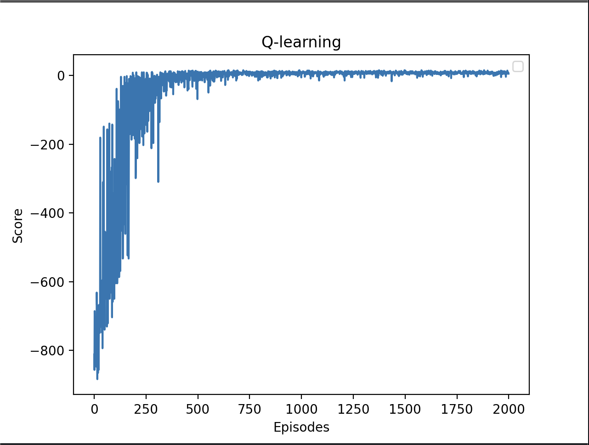

 ## Taxi

I have conducted around 2000 episodes with 200 steps each.

First 10 episodes show us how bad Q-Learning is:
- Episode 0: Score: -839, Epsilon: 1.000
- Episode 1: Score: -794, Epsilon: 0.995
- Episode 2: Score: -731, Epsilon: 0.990
- Episode 3: Score: -695, Epsilon: 0.985
- Episode 4: Score: -812, Epsilon: 0.980
- Episode 5: Score: -704, Epsilon: 0.976
- Episode 6: Score: -722, Epsilon: 0.971
- Episode 7: Score: -803, Epsilon: 0.966
- Episode 8: Score: -794, Epsilon: 0.961
- Episode 9: Score: -776, Epsilon: 0.956
- Episode 10: Score: -749, Epsilon: 0.952

Final 10 episodes clearly demostrate that Q-Learning has improved drastically:
- Episode 1990: Score: 12, Epsilon: 0.010
- Episode 1991: Score: 9, Epsilon: 0.010
- Episode 1992: Score: 7, Epsilon: 0.010
- Episode 1993: Score: 8, Epsilon: 0.010
- Episode 1994: Score: 12, Epsilon: 0.010
- Episode 1995: Score: 9, Epsilon: 0.010
- Episode 1996: Score: 6, Epsilon: 0.010
- Episode 1997: Score: 9, Epsilon: 0.010
- Episode 1998: Score: 5, Epsilon: 0.010
- Episode 1999: Score: 4, Epsilon: 0.010

