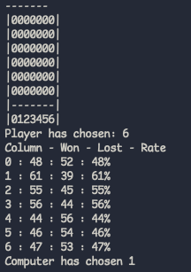
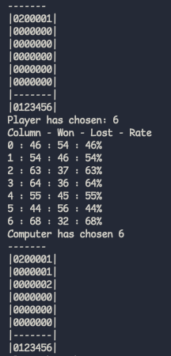
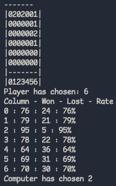
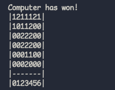
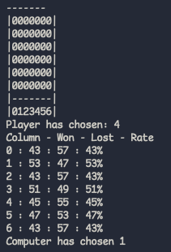
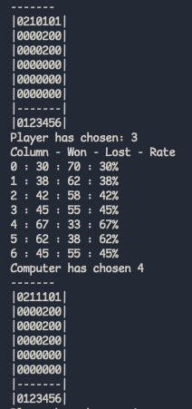
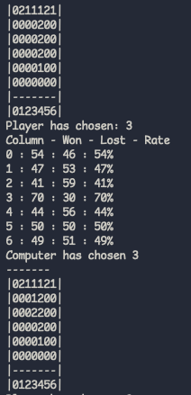
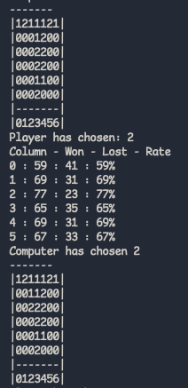
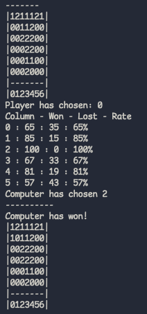

# Monte Carlo Algorithm
Code for this task can be found at [this link](https://gitlab.cs.taltech.ee/mausma/iti0210-2023/-/blob/master/H3/main.c)

## Introduction
The data will be presented in a form of screenshots, as I find it the easiest way to explain what is happening.

Nevertheless, relevant data for each played game can be found in [`data.txt`](./data.txt) file,
which literally saves the state of the board, winning percentage of simulations and the move made by a
computer.

## The Algorithm
As the program includes a lot of in-depth code, some clarifications must be made.

Little vocabulary:

* possibility = move from 0 to 6, or basically a column

First of all, the board is saved as a 1D array, not as a matrix. This allows for faster calculations, though introduces a little bit of complexity, as each column and row has to be very carefuly calculated.

Finally, as per Monte Carlo method, each simulation is absolutely random. What does it mean? Basically, the program checks which of 7 columns is free, and for each possibility plays N-games (see `#define N_MOVES` to manipulate the amount of simulations). In N-game, each move made by "Fake Player" and the computer are absolutely random. Thus, by doing so, we can calculate the winning percentage and choose the best possible move.

The logic of the Algorithm:

* Let a player make a move
* Update the board
* Get possible moves for a computer
* For each possibility play N-games and choosen the one with most wins and least losses.
* Update the board
* Repeat

**NB!** [`data.txt`](./data.txt) is overwritten each time a game is played! It saves the played games' data for future research.

## Observations
When each party makes its first move, the winning rate of a computer is generally quite low. Why? Well, when there is an absolutely blank board, how can one determine
what move will let it win? The initial state is absolutely random in terms of win/loss.

However, as play further, it seems as if the computer learns our patterns. As can be seen in this screenshot, it has literally blocked my pattern, thus lowering my
possibility of winning this game.

)

As we go to the end, the winning rate goes up drastically.

Let's take a look at a more complex game.

This is the end result:

As we start the game, the winning rate is quite low.

However, as we go further, the percentage fluctuates between 30% to 70%. Here I have tried to make a check-mate and see the rate.

Though I have changed my mind a little bit later...

As we move forward, the computer makes moves that frustrate me... I guess I should have finished the game when I had a chance:')

And here computer makes a checkmate on me...

All data related to the second game can be found in [`data.txt` file](./data.txt)

As can be seen, the Monte Carlo method, by using an absolute randomization, "learns" from other party's patterns and makes its steps on the way to victory.

## Issues

* Sometimes when one or two rows are filled up, the program gets stuck in a loop. I could not find the issue, thus left it as is.
* For some reason, diagonal checks sometimes fail, as they stop at 3 elements. It happens rarely and mostly in a combination with previous issue. I guess
it could be related to how I resave the data in the same memory address, though cannot be sure.