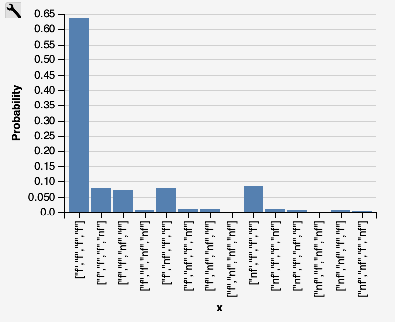

# Probablistic Programming

## The General Explanation
You bought a 4-pack of no-name supermarket AA batteries. Sure, they were cheap, but there is also a 10% probability that any one battery will already be half-empty when bought brand new. Questions:

## Little dictionary

* f = full
* nf = not full (basically empty)

I run the code around 2000 times to calculate a more precise result.

**NOTE!** The presented visualization has very small gaps, thus the taken percentage is approximate.

### First situation
*Instead of buying the pack, you received an opened (but unused, meaning that the battery charge is the same as it was when bought) 4-pack from a friend. The friend casually mentions that at least one of the batteries is empty. What is the probability that there are three full batteries in the pack?*

First of all, we have to consider two different samples: when our friend lies and when he does not.

**If our friend lies**, the first battery is either dead or not with probability 0.9, thus
the test case checks if one of them is dead, and other three are full.

Code:

```
var gen = function () {
var first = flip(0.9) ? 'f' : 'nf'
var second = flip(0.9) ? 'f' : 'nf'
var third = flip(0.9) ? 'f' : 'nf'
var fourth = flip(0.9) ? 'f' : 'nf'
return [first, second, third, fourth]
}

viz.hist(repeat(2000, gen))
```

Visualisation: 



Data extracted from the graph:

* [f, f, f, nf]: ~0.065
* [f, f, nf, f]: ~0.085
* [f, nf, f, f]: ~0.070
* [nf, f, f, f]: ~0.090

Total probability: 0.065 + 0.085 + 0.070 + 0.090 = 0.31 <=> 31%

**If our friend does not lie**, one of the batteries is 100% empty, therefore 
we only consider the probability where the last three are full. We do not really care
about the order of the batteries, so we can simply choose the first one as empty.
The code below defines the first battery as empty, so only [nf, f, f, f] is used for data extraction.

Code:

```
var gen = function () {
var first = flip(1) ? 'nf' : 'f'
var second = flip(0.9) ? 'f' : 'nf'
var third = flip(0.9) ? 'f' : 'nf'
var fourth = flip(0.9) ? 'f' : 'nf'
return [first, second, third, fourth]
}

viz.hist(repeat(2000, gen))
```

Visualisation:


Data extracted from the graph:

* [nf, f, f, f]: >0.70

Total probability: >0.70 <=> >70%

### Second situation
*You opened a new pack yourself, took out the first battery and measured the charge. It was half-empty. What is the probability that the remaining three batteries are full?*

In this situtation we take into account the remaining three batteries. This situation is actually identical
to the one I have previously reviewed but I will rerun the test just in case something weird pops up.

Code:

```
var gen = function () {
var first = flip(0) ? 'f' : 'nf'
var second = flip(0.9) ? 'f' : 'nf'
var third = flip(0.9) ? 'f' : 'nf'
var fourth = flip(0.9) ? 'f' : 'nf'
return [first, second, third, fourth]
}

viz.hist(repeat(2000, gen))
```

Visualisation:


Data extracted from the graph:

* [nf, f, f, f]: >0.70

Total probability: >0.70 <=> >70%